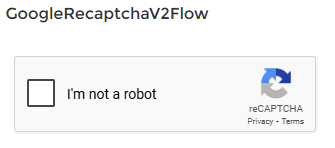
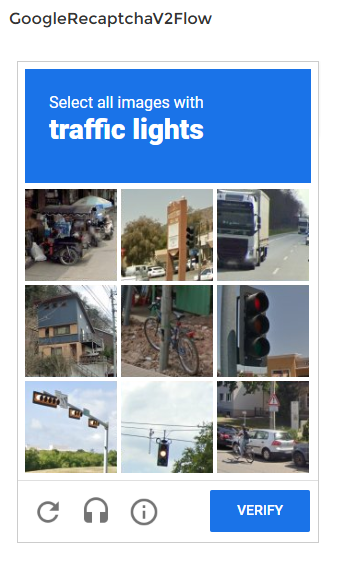

# Google Recaptcha v2 checkbox Flow Component for Salesforce

This component was developed by me, because I want to avoid any spam or brute force attacks on my flow, that is deployed with Lightning Out on an external page and on a community.

## Basic Concept

The flow component actually relies on three parts: An aura component, an HTML static resource and an Apex class. The aura component embeds the static resource as an iframe. The HTML file references the Google Recaptcha API and renders the Recaptcha. The iframe tells the aura component the current height and width of the content (e.g. recaptcha challenge) by using `Window.postMessage` and will also communicate the captcha response in the same way after the user completes the challenge. In order to allow receiving messages from the iframe by `Window.postMessage`, the aura component uses a server-side call to generate a few permitted basic Salesforce URLs for the static resource. Afterwards, the aura component will take the token and call a method in the apex class. The apex class will verify the token against the secret key in a callout to Google. If the verification is successful, the aura component will switch it's variable `isHuman` to `true` and let the user go to the next screen.

## Features

- Google Recaptcha v2 checkbox flow component
- A responsive layout, that adapts to the size of the recaptcha, especially the challenge window
- Server side verification of the recaptcha response
- Fully compatible to all browsers (tested with Firefox, Chrome, Internet Explorer 9, Chrome Mobile)
- Run your flow on communities, lightning pages and almost anywhere

## Available Components

This repository now includes both an **Aura component** and a **Lightning Web Component (LWC)** implementation:

- **Aura Component**: `googleRecaptcha` - Original implementation (uses component properties for keys)
- **LWC Component**: `lwcGoogleRecaptcha` - Modern LWC with enhanced security (uses Custom Metadata Type for keys)

Both components offer identical features. The LWC version is recommended for new implementations as it follows modern Salesforce development patterns and provides enhanced security by storing secret keys server-side only.

## Flow input and output variables

- `Is Human?`: defaults to false, will be set to true, if the recaptcha verifies you human
- `Origin Page URL (optional)`: A comma seperated list of URLs, where your flow runs. e.g.: in the form of: https://example.com, https://myOrg.force.com. OriginPageURL refers to the URL of the static resource, which contains the Recaptcha as HTML. The URL varies depending on where your flow is deployed. A default set of URLs is generated by the component: https://myOrgURL.my.salesforce.com, https://myOrgURL.lightning.force.com, https://myOrgURL--c.visualforce.com, https://myCommunityURL.force.com. For special URLs or cases, use this variable to add more URLs, especially those, that you have entered in the Google Recaptcha Admin Console.
- `Server Side Verification?`: defaults to true, if set to false, the captcha response will not be verified against your secret key in a callout to google. Avoid turning this off
- `Required?`: defaults to true, makes it required to pass the recaptcha
- `Required Message (optional)`: the error message displayed, if the user just clicks on next and has not verified he his human yet
- `Required only once?`: If true, the Recaptcha will only appear once. Else it will always appear on the screen. Consider this option, if you want to use the previous button to return to the screen, where this component is deployed. Defaults to false.
- `Recaptcha Secret Key`: The secret key for your domain
- `Recaptcha Site Key`: The site key for your domain
- `Recaptcha Frame Title (optional)`: For accessibility usage. Some browsers like Firefox won't directly tab into the checkbox and will instead focus the recaptcha frame at first. If you provide some text here, screenreaders will read this text if they focus the iframe. Defaults to: I'm not a robot captcha.
- `Flow Interview GUID`: The Flow Interview GUID of the current flow interview. You can get it by using the global variable `$Flow.InterviewGuid`. This is required for server side verification.

## Installation instructions

### Part 1

Use the Deploy to Salesforce button to install the component:\
<a href="https://githubsfdeploy.herokuapp.com">

</a>

### Part 2

Generate your own site and secret key here: https://www.google.com/recaptcha/. I have added the Testkeys from Google as default, so you can try it out of the box. The caveat is the test keys might not show the challenge even in incognito mode. It's better to create your own keys for your domain. You can add domains later in the Google Recaptcha Admin Console.

### Part 3

Assign the user, that wants to run the flow, the Permission Set `Google Recaptcha Flow Component`. For example a to a Community Site Guest user by clicking on Settings in Experience Builder, under General select the Guest User Profile, then View Users, Select the Guest User, Edit Permission Set Assignments and add the Permission Set.

### Part 4

After you place the flow component on a screen, configure the properties as described in the section above. Make sure to set the site key and secret key correctly as well as the Flow Interview GUID.

### Part 5

After the screen, add an Apex action that invokes the invocable method `Validate reCAPTCHA` from the `GoogleRecaptchaHandler` class, passing the Flow Interview GUID. Then use a decision element to check the output Boolean from the Apex action. If true, the user has passed the challenge.

### Part 6 (optional)

Your flow is deployed somewhere else? Then set `originPageURL` correctly to the domain, where your flow runs in e.g. in the form of https://example.com. There's no need to add the rest of the URL path. It just needs to have the protocol, domain (and maybe the port). Some URLs are generated by the component, but they may not cover all deployment ways. Check the component reference for more information.

## Using the Lightning Web Component (LWC)

The LWC component `lwcGoogleRecaptcha` offers the same functionality as the Aura component with modern Lightning Web Component architecture. To use the LWC version:

### In Flows

1. Add the `Google reCAPTCHA v2 (LWC)` component to your flow screen
2. Configure the same properties as the Aura component (all attributes are compatible)
3. The component API names follow LWC naming conventions (camelCase in JavaScript, kebab-case in HTML)

### In Lightning Pages

You can add the LWC component to Lightning App Pages, Record Pages, Home Pages, and Community Pages through the Lightning App Builder.

### Component Properties (LWC)

**Required Property:**

- `google-recaptcha-setting-name` (googleRecaptchaSettingName): **Required**. Name of the Custom Metadata Type record (GoogleRecaptchaSetting__mdt) containing your site and secret keys

**Other Properties:**

- `is-human` (isHuman): Output variable for human verification status
- `origin-page-url` (originPageURL): Comma-separated list of allowed URLs
- `required`: Makes the reCAPTCHA required (default: false - set to true when needed)
- `required-message` (requiredMessage): Custom error message
- `required-once` (requiredOnce): Show captcha only once
- `frame-title` (frameTitle): Accessibility title for the iframe
- `flow-guid` (flowGuid): Flow Interview GUID for server-side verification

**Security Enhancement:**
The LWC component uses Custom Metadata Type to securely store your Google reCAPTCHA keys. The secret key is never exposed to the client and is only accessed server-side during verification.

### Setting Up Custom Metadata Type (Required for LWC)

Before using the LWC component, you must create a Custom Metadata Type record:

1. Navigate to **Setup → Custom Metadata Types → Manage Records** next to `GoogleRecaptchaSetting`
2. Click **New** to create a record
3. Enter:
   - **Label**: e.g., "Portal1 Google Recaptcha Setting"
   - **GoogleRecaptchaSetting Name**: e.g., "Portal1GoogleRecaptchaSetting" (use this in the component)
   - **Site Key**: Your Google reCAPTCHA site key
   - **Secret Key**: Your Google reCAPTCHA secret key
4. Save the record

**Example Usage:**

```xml
<c-lwc-google-recaptcha
    google-recaptcha-setting-name="Portal1GoogleRecaptchaSetting"
    is-human={isHuman}
    required={true}
    flow-guid={flowGuid}
></c-lwc-google-recaptcha>
```

### Key Features of LWC Implementation

- **Enhanced Security**: Secret keys stored in Custom Metadata Type, never exposed to client
- Comprehensive JSDoc documentation for all methods and properties
- Modern ES6+ JavaScript with proper lifecycle hooks
- ESLint compliant code following Salesforce standards
- Better memory management with proper cleanup in `disconnectedCallback`
- Site key fetched dynamically from server on component initialization

## Screenshots

Initial View

Challenge View


## FAQ

- Why not use a lightning web component?
  - **UPDATE**: An LWC version (`lwcGoogleRecaptcha`) is now available! The LWC implementation successfully handles postMessage communication from the iframe, just like the Aura component.
- Why not use a Visualforce Page instead of a static resource?

  - A visualforce page is not public by default. Using Recaptcha means, that you often want to protect a flow, that is available for the public.

- Can you support Google Recaptcha v3?

  - I have to check but I don't think so. Maybe implementing Google Recaptcha v2 invisible would be easy.

- The Recaptcha tells me, that it can only be used for testing purposes!

  - Create your own site and secret key and insert them as explained.

- The Recaptcha challenge is displayed in a small window, that is not scrollable

  - Check the `originPageURL`variable and set it correctly. Otherwise the aura component will not receive the correct height and width of the recaptcha challenge.

- Eventhough I successfully passed the recaptcha challenge, the flow will not let me go to the next screen.

  - Check the `originPageURL`variable and set it correctly. Otherwise the aura component will not receive the recaptcha response.
  - Check if the user, that runs the flow, has either the Permission Set `Google Recaptcha Flow Component` or directly assign access to the `GoogleRecaptchaHandler` Apex class.

- Is this component secure?

  - Well, no. To increase security, the Secret Key should be saved on the server e.g. in the Apex class. Always activate the server side verification. If you want to increase security, then set the `targetPageURL` properly in the static resource if possible. See also: https://developer.mozilla.org/en-US/docs/Web/API/Window/postMessage

- I encountered error in experience portal: "Hmm, that didn't work. Check your internet connection and refresh the page. If the issue persists, ask for help with this error: This feature is not currently enabled for this user." How to resolve it?
  - Make sure the user has been assigned the permission set.
  - Ensure the user can run the flow.
  - Ensure "Allow guest users to access public APIs" is turned on for the site if it's an issue for guest users.

## Further Information

It's possible to host the HTML file of the static resource somewhere else. This is recommended if you use Lightning Out, because X-Frame-Options will not allow you to embed the static resource directly in an external page. If you do so, then you have to change the `src` tag in the aura component. You also have to add the iFrame URL to the `CSP Trusted Sites` in Salesforce Setup. Consequently, the `originPageURL` variable would be the iframes' location.

## Contributions

I want to mention all sources that helped me to develop this component. Some of them were out in the wild for years, but I put all ideas together and added a bunch of new features like combining Aura component and a static resource, challenge detection and resizing, automatic URL creation and so on.

Jami Gibbs (Basic Concept)\
https://blog.jamigibbs.com/integrating-google-recaptcha-v2-into-a-salesforce-lightning-componentx/

Kevin Hill (Using a static resource)\
https://salesforce.stackexchange.com/questions/252419/google-recaptcha-v3-implementation-in-lightning-web-component

Craig Johnson (Server Side Verification)\
https://www.learncommunitycloud.com/s/article/Implementing-reCAPTCHA-in-Community-Cloud#RecaptchaV2Checkbox

Ramana Varasi (Basic Concept)\
http://varasi.com/salesforce/embedding-google-recaptcha-v2-in-salesforce-lightning-component-to-increase-security/

Miguel Duarte (Basic Concept)\
http://www.rightitservices.com/resource-hub/item/1319-google-recaptcha-v2-in-salesforce-custom-lightning-component

Xiaoan Lin (synchronous apex call)\
https://www.xgeek.net/salesforce/using-promise-for-apex-server-side-request-in-lightning-component/
